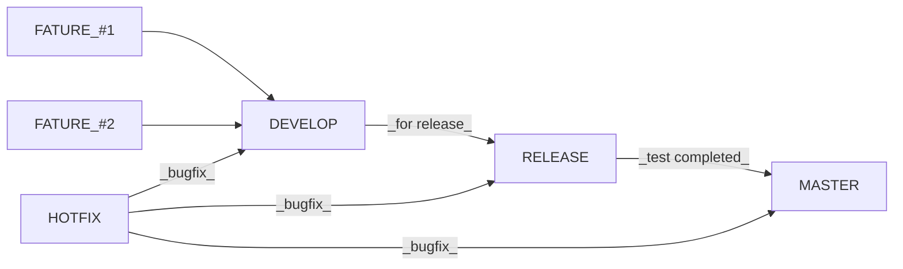
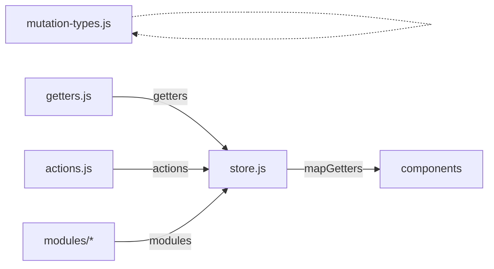

# Remote Guide

- 이 프로젝트의 정식 명칭은 `Remote-Web 2.0`입니다.
- 이 프로젝트는 VueJS 2.0 + Webpack 환경에서 개발되며, 주요 개발환경은 아래와 같습니다. - 브라우저는 **Chrome 최신 버전**을 지원합니다. - **HTML5** 문서형태를 사용합니다. - **ES6(ECMAScript 2015) Stage-2 문법**을 토대로 작성되었습니다. - [SCSS](https://sass-lang.com/)를 사용합니다.

## Git branch model



## Getting started

### 준비사항

> npm : ^5.6.0

## Installation

```bash
# windows
$ npm install --global node-gyp
$ npm install --global --production windows-build-tools
$ npm install

# else
$ npm install
```

## Running the app

```bash
# local mode
$ npm run start:local

# develop mode
$ npm run build:develop
$ npm run start:develop

# production mode
$ npm run build:production
$ npm run start:production
```

## Running the app with Docker

```bash
# develop mode
$ docker build -t webclient:develop -f Dockerfile.develop .
$ docker run --name webclient-develop -d -p 8887:8887 webclient:develop

# production mode
$ docker build -t webclient:production -f Dockerfile .
$ docker run --name webclient-production -d -p 8887:8887 webclient:production
```

## Packaging the app

```bash
# production mode
$ npm run build:production
$ npm run start:pkg

result: linux-x64, macos-x64, win-x64 (node8)
```

## Running the app with package

```bash
$ export NODE_ENV=`env`
$ export SSL_ENV=`public or private`
$ ./remote-webclient-`os`
```

## Structure

프로젝트 디렉토리는 아래처럼 나뉩니다.

> build : 프로젝트 빌드설정 파일 디렉토리\
> dist : 산출물 디렉토리\
> node_modules : 의존모듈 디렉토리\
> src : 작업 디렉토리 (상세 내용은 아래에)\
> ssl : 로컬 개발서버용 SSL 관련 디렉토리

```
build/
dist/
node_modules/
src/
  |-- api/        <-- 외부서버 관련 디렉토리
  |
  |-- apps/       <-- 진입파일 디렉토리
  |
  |-- assets/     <-- 리소스 관련 디렉토리
  |
  |-- components/ <-- 화면 컴포넌트 관련 디렉토리
  |
  |-- languages/  <-- 코드 별 언어관련 디렉토리
  |
  |-- mixins/     <-- Vue mixin 관련 디렉토리
  |
  |-- plugins/    <-- 외부 라이브러리 연동 디렉토리
  |
  |-- routers/    <-- 라우팅 관련 디렉토리
  |
  |-- stores/     <-- 공통 관련 디렉토리
  |
  `-- utils/      <-- 사용자정의 유틸 디렉토리
```

### src/api

외부 서버와의 api 연동 관련 디렉토리.

```
api
|-- gateway.error.json  <-- Gateway서버 에러 목록
|-- gateway.js          <-- Gateway 발/수신 관련 파일
`-- servers.js          <-- 서버정보 (gateway, notification, signaling, turn...) - deprecated
```

### src/apps

프로젝트 앱 초기파일 디렉토리.

```
apps
|-- app.html
|-- app.js
`-- app.vue
```

### src/assets

프로젝트 컨텐츠 파일 디렉토리.

```
assets
|-- font/
|-- image/
|-- json/   <-- lottie 파일 등 디렉토리
|-- media/  <-- video/audio 파일 디렉토리
`-- style/  <-- scss 파일 디렉토리
```

### src/components

프로젝트 컴포넌트 파일 디렉토리.

```
components
|-- modules/     <-- 모듈 디렉토리 (상위중첩)
|-- service/     <-- 서비스페이지 관련 디렉토리
|-- test/        <-- 테스트코드 관련 디렉토리
`-- NotFound.vue <-- 404 Not Found 페이지
```

### src/languages

프로젝트 다국어데이터 JSON 파일 디렉토리.

### src/mixins

기능 별 mixin 정의 파일 디렉토리.

### src/plugins

프로젝트 플러그인 모듈 디렉토리.

### src/routers

프로젝트 라우팅관련 파일 디렉토리.

### src/stores

Vuex 구성 파일 디렉토리.
기본적으로 module 형태로 작업하며 `getter`와 `action` 부분은 한 파일로 관리한다.



### src/utils

유틸성 모듈 디렉토리.

## Plugins

| Library         | 설명                             | Homepage                                                       |
| --------------- | -------------------------------- | -------------------------------------------------------------- |
| openvidu        | 다자간 통신 라이브러리             | https://github.com/OpenVidu/openvidu                           |
| element-ui      | UI 컴포넌트 라이브러리           | https://element.eleme.io/                                        |
| vue-moment      | 시간 표시 포맷 라이브러리        | https://github.com/brockpetrie/vue-moment                        |
| vue2-scrollbar  | 스크롤바 라이브러리              | https://github.com/BosNaufal/vue2-scrollbar                     |
| vue-toasted     | 토스트메시지 지원 라이브러리     | https://github.com/shakee93/vue-toasted                          |
| sweetalert2     | 커스텀 alert창 라이브러리        | https://sweetalert2.github.io/                                  |
| vue-i18n        | 다국어처리 지원 라이브러리       | https://kazupon.github.io/vue-i18n/                             |
| fabric.js       | 드로잉 기능 지원 라이브러리      | https://github.com/fabricjs/fabric.js                           |
| pdfjs-dist      | PDF 렌더링 라이브러리           | https://github.com/mozilla/pdf.js                               |
| lottie-web      | 포인팅 lottie 라이브러리        | https://github.com/airbnb/lottie-web                            |

## Component

vue component 파일은 아래와 같은 형태와 순서로 작성합니다.

```html
<template>
  <!-- Something. -->
</template>
<script>
  name,
  extends,
  mixins,
  components,
  filters,
  props,
  data(),
  computed,
  watch,
  methods,

  /* Lifecycles */
  beforeCreate(),
  created(),
  beforeMount(),
  mounted(),
  beforeUpdate(),
  updated(),
  beforeDestroy(),
  destroyed()
</script>
<style lang="scss" scoped>
  /* 컴포넌트 특성에 따라 존재 */
</style>
```

## Custom Event

```
popover:close
aside:fold
control:speaker
control:mic
control:capture
control:record
control:mode
control:undo
control:redo
control:clear
control:close
```

## Layout

사용하는 플러그인은 다음과 같습니다.
1. i18n
2. openvidu
3. scrollbar

## Layout

`Remote` 프로젝트의 특성상 크게 2가지의 레이아웃이 생성됩니다.

1. 로그인 및 메인 공통 레이아웃
2. 통신 서비스 레이아웃

전체 공통 레이아웃은 아래와 같습니다.

```html
<html>
  <head>
    <meta charset="utf-8" />
    <title>타이틀</title>

    <meta http-equiv="X-UA-Compatible" content="IE=edge,chrome=1" />
    <meta
      name="viewport"
      content="width=device-width,initial-scale=1,minimum-scale=1,maximum-scale=1,user-scalable=no"
    />
    <link rel="shortcut icon" href="" />
  </head>
  <body>
    <div id="container">
      <!-- 레이아웃 영역 -->
    </div>
  </body>
</html>
```

### 1. 로그인 및 메인 레이아웃

```html
<div>
</div>
```

### 2. 통신 서비스 레이아웃

```html
<div class="main-wrapper">

  <header class="header" >

    <nav></nav>

  </header>

  <service-wrapper>
    
    <sub-view></sub-view>

    <main></main>

  </service-wrapper>

</div>
```

## Style

> `/src/assets/style/README.md` 참고

## Active URL

> `/src/routers/README.md` 참고


## Branch List

| Branch             | 설명                        | URL                                     | Last Update | Version | 기타 |
| -------------------| --------------------------- | --------------------------------------- | ----------- | ------ | ---- |
| master             | 운영                        |               | -           | v2.0   | - |
| develop            | 개발                        |              | -           | v2.0   | - |
