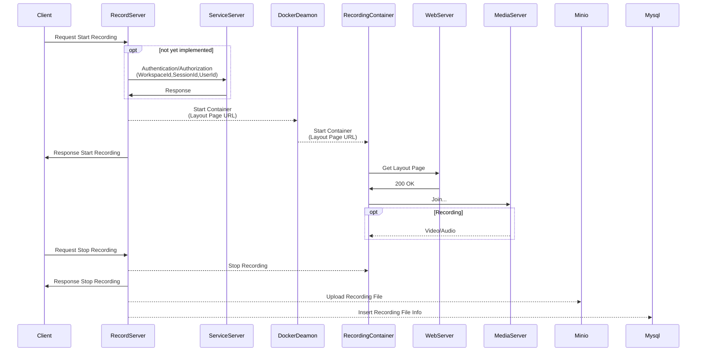

```mermaid
sequenceDiagram
    participant Client
    participant RecordServer
    participant ServiceServer
    participant DockerDeamon
    participant RecordingContainer
    participant WebServer
    participant MediaServer
    participant Minio
    participant Mysql
    Client->>RecordServer: Request Start Recording
    opt not yet implemented
        RecordServer->>ServiceServer: Authentication/Authorization<br>(WorkspaceId,SessionId,UserId)
        ServiceServer->>RecordServer: Response
    end
    RecordServer-->>DockerDeamon: Start Container<br>(Layout Page URL)
    DockerDeamon-->>RecordingContainer: Start Container<br>(Layout Page URL)
    RecordServer->>Client: Response Start Recording
    RecordingContainer->>WebServer: Get Layout Page
    WebServer->>RecordingContainer: 200 OK
    RecordingContainer->>MediaServer: Join...
    opt Recording
        MediaServer-->>RecordingContainer: Video/Audio
    end
    Client->>RecordServer: Request Stop Recording
    RecordServer-->>RecordingContainer: Stop Recording
    RecordServer->>Client: Response Stop Recording
    RecordServer-->>Minio: Upload Recording File
    RecordServer-->>Mysql: Insert Recording File Info
```
