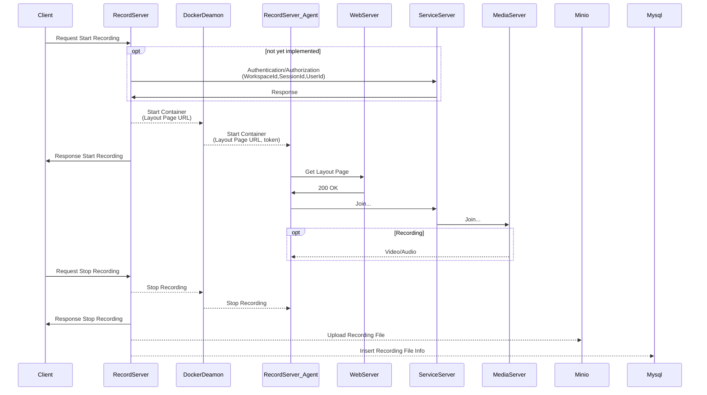

```mermaid
sequenceDiagram
    participant Client
    participant RecordServer
    participant DockerDeamon
    participant RecordServer_Agent
    participant WebServer
    participant ServiceServer
    participant MediaServer
    participant Minio
    participant Mysql
    Client->>RecordServer: Request Start Recording
    opt not yet implemented
        RecordServer->>ServiceServer: Authentication/Authorization<br>(WorkspaceId,SessionId,UserId)
        ServiceServer->>RecordServer: Response
    end
    RecordServer-->>DockerDeamon: Start Container<br>(Layout Page URL)
    DockerDeamon-->>RecordServer_Agent: Start Container<br>(Layout Page URL, token)
    RecordServer->>Client: Response Start Recording
    RecordServer_Agent->>WebServer: Get Layout Page
    WebServer->>RecordServer_Agent: 200 OK
    RecordServer_Agent->>ServiceServer: Join...
    ServiceServer->>MediaServer: Join...
    opt Recording
        MediaServer-->>RecordServer_Agent: Video/Audio
    end
    Client->>RecordServer: Request Stop Recording
    RecordServer-->>DockerDeamon: Stop Recording
    DockerDeamon-->>RecordServer_Agent: Stop Recording
    RecordServer->>Client: Response Stop Recording
    RecordServer-->>Minio: Upload Recording File
    RecordServer-->>Mysql: Insert Recording File Info
```
